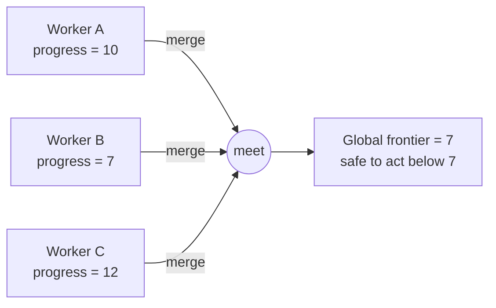

# antichain

**Track progress across a distributed system — without a central coordinator.**

[](https://github.com/trickle-labs/antichain/actions/workflows/ci.yml)
[](https://crates.io/crates/antichain)
[](https://docs.rs/antichain)

```toml
[dependencies]
antichain = "0.2"
```

---

## The 30-second version

Many workers are chewing through a stream of work. Every so often, *something* needs to
know: **"Is it safe to act now? Has everyone gotten far enough?"**

The textbook answer is to put a coordinator in the middle: every worker reports its progress,
the coordinator computes a single global number, and broadcasts "you may proceed." That works
— but the coordinator is now a bottleneck and a single point of failure.

`antichain` lets workers answer that question **by merging their progress directly**, in any
order, over any network, with no coordinator at all:

```rust
use antichain::Frontier;

// Two workers report how far they've gotten, independently.
let worker_a = Frontier::from_elem(10u64);
let worker_b = Frontier::from_elem(7u64);

// The safe global progress is the *meet* — the most conservative bound.
let global = worker_a.meet(&worker_b);
assert_eq!(global, Frontier::from_elem(7u64));

// It doesn't matter who merges with whom, or in what order — same answer every time.
assert_eq!(worker_a.meet(&worker_b), worker_b.meet(&worker_a));
```

That `meet` operation is the whole crate. It is **commutative, associative, and idempotent**,
which is exactly what lets you delete the coordinator.

---

## Why that works

The merge has three algebraic properties:

| Property | Meaning | Why you care |
|----------|---------|--------------|
| **Commutative** | `meet(a, b) == meet(b, a)` | Workers can merge in any pairing. |
| **Associative** | `meet(a, meet(b, c)) == meet(meet(a, b), c)` | Grouping doesn't matter. |
| **Idempotent** | `meet(a, a) == a` | Duplicate messages are harmless. |

Put together, they guarantee that nodes can gossip progress over a hostile network — delayed,
reordered, duplicated — and **still converge to the identical, correct answer**, with no lock,
no pause, and no leader.



This is the same idea that makes CRDTs work — applied to *progress tracking* instead of data.

---

## When should I reach for this?

Use `antichain` when you have **distributed progress** to track and want to avoid a coordinator:

- **Stream processing** — compute a global watermark across many parallel workers.
- **Replication / log shipping** — find the highest offset that *every* replica has reached.
- **Backfill with gaps** — track which ranges are done when work arrives out of order
  (via the companion [`antichain-intervals`](crates/antichain-intervals) crate).
- **Quorum / acknowledgement** — track which members have acknowledged, set-theoretically.
- **Multi-dimensional time** — progress along independent axes (partition × offset, epoch × seq).

If your progress is just *one monotonic number per worker*, this collapses to an efficient,
allocation-free min/max merge. If it's genuinely multi-dimensional, the same API handles it.

---

## The toolbox

Pick the **partial order** that matches your problem; `meet` then computes the answer you want.
Full worked recipes for each are in the **[Cookbook](docs/cookbook.md)**.

| You have… | Reach for |
|-----------|-----------|
| A single watermark / offset / clock | `Frontier<u64>` |
| Two independent dimensions | `Frontier<ProductTimestamp<A, B>>` |
| Outer clock dominates, inner breaks ties | `Frontier<Lexicographic<A, B>>` |
| A topology that rescales at runtime (shards come and go) | `MapLattice<K, V>` |
| Which discrete members have acknowledged | `SetLattice<T>` |
| A lower bound that merges by `max` | `Max<T>` (and `Min<T>`) |
| A value confined to a finite `[min, max]` range | `Bounded<T>` |
| A stream that can permanently **close** / hasn't **started** | `WithTop<T>` / `WithBottom<T>` |
| Out-of-order progress with gaps | `IntervalSetLattice<T>` ([`antichain-intervals`](crates/antichain-intervals)) |

Need two at once? **Compose them** — that's the whole point: `Frontier<(Max<u64>, Min<u64>)>`,
`MapLattice<ShardId, Frontier<ProductTimestamp<u64, u64>>>`, and so on.

---

## The core primitives

- **`Lattice`** — a trait for types with `meet` (greatest lower bound) and `join` (least upper bound).
- **`Antichain<T>`** — a set of mutually incomparable elements of `T`, kept minimal automatically.
- **`Frontier<T>`** — a progress claim backed by an `Antichain<T>`: *"everything strictly below this
  boundary is complete."*

## What this crate is *not*

- A networking layer or gossip protocol
- A consensus, leader-election, or lease mechanism
- A storage engine or query planner

Those are things you might *build on top of* this primitive — they are not the primitive. This
crate does one thing: **progress tracking. No ownership, no membership, no consensus.**

---

## A bit more detail

```toml
[dependencies]
antichain = "0.2"
# with serde support:
# antichain = { version = "0.2", features = ["serde"] }
# in a no_std environment (needs a global allocator):
# antichain = { version = "0.2", default-features = false }
```

- **`no_std` friendly** — disable the default `std` feature; only `alloc` is required.
- **Allocation-free fast path** — totally-ordered frontiers (`Frontier<u64>`) never touch the heap;
  only genuinely partially-ordered antichains of width ≥ 2 spill to a `Vec`.
- **`#![forbid(unsafe_code)]`** and **`#![deny(missing_docs)]`** on every crate.

---

## Formally proven, not just tested

A Fizzbee model-checking spec lives at [`specs/frontier_convergence.fizz`](specs/frontier_convergence.fizz).
It mechanically verifies the convergence theorem:

> **Convergence theorem.** If two nodes have each observed any subset of the same update set, in
> any order, their `Frontier` values are identical after merging all updates.

The model checker exhaustively enumerates *every* interleaving of update deliveries across all
nodes, and the convergence assertions hold in every reachable state — proving no adversarial
ordering can cause divergence. To verify locally:

```sh
brew tap fizzbee-io/fizzbee && brew install fizzbee
fizz specs/frontier_convergence.fizz
```

On top of that, every algebraic law (commutativity, associativity, idempotence, and the
universal consistency law `a ≤ b ⟺ meet(a,b)==a ⟺ join(a,b)==b`) is property-tested over
10 000+ random cases for every public type.

---

## Learn more

- **[Tutorial](docs/tutorial.md)** — *"from one number to a frontier,"* a narrative walkthrough
  that builds intuition from scratch before introducing any lattice vocabulary.
- **[Cookbook](docs/cookbook.md)** — *"which type for which problem,"* with a decision table and a
  compilable recipe for every public type.
- **[Prior art & positioning](docs/comparison.md)** — how this crate relates to timely-dataflow
  and CRDT libraries, and when to use each.
- **[Design notes](docs/idea.md)** — the motivation, the algebra, and the boundaries of the problem.
- **[Roadmap](roadmap.md)** — how the crate was built, phase by phase, and what's next.
- **[Changelog](CHANGELOG.md)** — release history.
- **[API docs](https://docs.rs/antichain)** — the full reference on docs.rs.

## Related crates

- **[`antichain-intervals`](crates/antichain-intervals)** — `IntervalSetLattice<T>` for tracking
  out-of-order progress with gaps (backfill, holes). Built on `antichain::Lattice`.

## License

Apache-2.0
